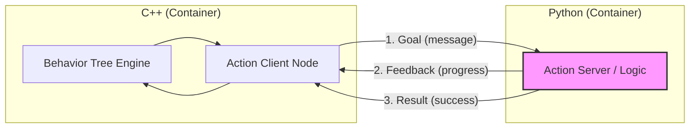

# BehaviorTree.CPP v4 for ROS 2 Jazzy (Docker 開発環境)

このリポジトリは、**ROS 2 Jazzy** 上で **BehaviorTree.CPP v4** を使用するための Docker 開発環境を提供します。

## 特徴
- **ROS 2 Jazzy 対応**: 公式の `ros:jazzy-ros-base` イメージをベースに構築。
- **BehaviorTree.CPP v4 標準搭載**: Jazzy 対応の最新版 (v4.9.0) がプリインストール済み。
- **永続的なワークスペース**: ビルド成果物 (`build`, `install`, `log`) はホスト側に保存されるため、コンテナを消しても再ビルドは不要。
- **サンプルパッケージ同梱**: すぐに動作確認ができる `bt_example` パッケージが含まれています。

## 動作要件
- Docker
- Docker Compose

## クイックスタート

### 1. 初回セットアップ & ビルド
以下のスクリプトを実行して、Docker イメージの作成と ROS 2 ワークスペースのビルドを行います。
```bash
chmod +x setup_workspace.sh
./setup_workspace.sh
```

### 2. 開発環境の起動
コンテナ内に入るには、以下のコマンドを実行します。
```bash
docker compose run --rm bt_dev
```

### 3. サンプルの実行
コンテナ内で、サンプルノードを起動して動作を確認します。
```bash
ros2 run bt_example bt_node
```

## Tips: 複数のターミナルを開く方法
Action Server と BT ノードを同時に動かす場合など、複数のターミナルでコンテナに入る必要があります。
ホスト側の `.bashrc` に便利なエイリアスを設定済みです。

1. **1つ目のターミナル (起動)**: 
   ```bash
   bt_start
   ```
2. **2つ目以降のターミナル (追加)**:
   ```bash
   bt_enter
   ```

## コンテナの終了方法
- **中から終了**: `exit` と打つか、`Ctrl + D` を押します。
- **外から終了**: `docker compose stop` を実行します。

## 可視化 (Groot2)
本環境は Behavior Tree 可視化ツール **Groot2** に対応しています。

1. **プログラム側の準備**: `main.cpp` 等で `Groot2Publisher` をインスタンス化します。
2. **Groot2 の起動**: ホスト側で Groot2 を起動します。
3. **接続**: 
    - Groot2 の **Monitor** タブを選択。
    - **Connect** ボタンをクリック（IP: `127.0.0.1`, Port: `1667`）。

### Groot2 のインストール (ホスト側)
本リポジトリには Linux 用のインストーラーが同梱されています。未インストールの場合は以下の手順でホスト側にインストールしてください。

```bash
# 実行権限を付与して実行
chmod +x Groot2-v1.9.0-linux-installer.run
./Groot2-v1.9.0-linux-installer.run
```
※ インストール先はデフォルト（`~/Groot2`）を推奨します。エイリアス設定もこのパスに基づいています。

## Python との連携 (Nav2 方式)
本環境では、Nav2 と同様に「Behavior Tree は C++、実際のロジックは Python」という構成が可能です。

### アーキテクチャ


### 実行方法
1. **Python ロジック (Action Server) の起動**:
    ```bash
    ros2 run bt_python_logic action_server
    ```
2. **Behavior Tree (C++) の起動**:
    ```bash
    ros2 run bt_example bt_node
    ```

## コードの解説
- [サンプルコードの解説](docs/SAMPLE_CODE.md): ソースコードの構造について
- [新規アクション開発フロー](docs/DEVELOPMENT_FLOW.md): 新しい機能を追加する際の手順について

## ディレクトリ構成
- `src/`: ROS 2 のソースコード（自分のパッケージはここに追加します）
- `Dockerfile`: コンテナの定義ファイル
- `docker-compose.yml`: コンテナの起動設定・マウント設定
- `setup_workspace.sh`: ビルド用のユーティリティスクリプト
- `build/`, `install/`, `log/`: ビルド成果物（ホスト側に生成されます）

## 開発ワークフロー (標準的な流れ)
本環境では、以下のサイクルで開発を進めるのが最も効率的です。

1. **コードの編集 (ホスト側)**: 
   VSCode 等のお好みのエディタを使用して、ホスト側の `src/` 内のソースコードを編集・保存します。
2. **ビルド (コンテナ内)**: 
   コンテナ内のターミナルでビルドコマンドを実行します。
   ```bash
   build
   ```
3. **環境の反映 (コンテナ内)**:
   ビルドした成果物を現在のセッションに反映させます。
   ```bash
   src
   ```
4. **プログラムの実行 (コンテナ内)**:
   ```bash
   run_logic  # (ターミナル1)
   run_bt     # (ターミナル2: bt_enter で入る)
   ```

## なぜ Docker 内でビルドするのか？
コンテナ内でビルドを行うことで、どの PC を使っても**「全く同じコンパイラ、全く同じライブラリのバージョン」**で開発を行うことができます。これにより、OS の差異による「自分の環境では動くのに他の人の環境では動かない」といったトラブルを防ぎ、ホスト OS をクリーンに保つことができます。
