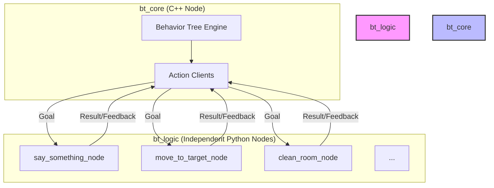

# BehaviorTree.CPP v4 for ROS 2 Jazzy (Professional Architecture)

このリポジトリは、**ROS 2 Jazzy** 上で **BehaviorTree.CPP v4** を使用し、堅牢でスケーラブルなロボットミッションを開発するための環境を提供します。

## プロフェッショナルな設計思想
本環境は、単なるサンプルの枠を超え、実際のロボット開発現場で採用される「技能（Logic）と知能（Core）の分離」を徹底しています。

- **bt_core (知能)**: C++ で記述された Behavior Tree エンジン。ミッションの進行管理と意思決定を行います。
- **bt_logic (技能)**: Python で記述された独立したアクションサーバー群。ロボットの具体的な各動作（移動、発話、アーム制御など）を担当します。
- **独立ノード構成**: 各アクションは個別のプロセスとして動作するため、一つのアクションのバグがシステム全体を停止させることはありません。

## 特徴
- **ROS 2 Jazzy 対応**: 最新の Jazzy 環境で最適化。
- **BehaviorTree.CPP v4**: リアルタイム性の高いミッション制御が可能。
- **Action Manager GUI**: プログラミングなしでアクションの生成・登録・削除ができる専用ツールを同梱。
- **Groot2 対応**: ツリーのリアルタイム監視と編集が可能。

## クイックスタート

### 1. 初回セットアップ
```bash
chmod +x setup_workspace.sh
./setup_workspace.sh
```

### 2. 実行ワークフロー
開発中は以下の 3 つのコマンドを常用します。

1. **技能サーバーの起動** (Terminal 1):
   ```bash
   bt_start
   run_logic  # すべての独立アクションノードを一括起動
   ```
2. **知能（ツリー）の起動** (Terminal 2):
   ```bash
   bt_enter
   run_bt     # Behavior Tree を実行
   ```
3. **アクション管理** (Terminal 3):
   ```bash
   bt_enter
   create_action  # GUI マネージャーを起動
   ```

## 開発ワークフロー

### アクションの追加・管理 (`create_action`)
専用の GUI ツールを使用して、ボイラープレート（雛形）を全自動生成します。

```bash
create_action
```
- **作成**: 名前とポートを入力するだけで、`.action`定義、C++登録コード、Python独立ノード、Launchファイル追記をすべて自動で行います。
- **削除**: 不要になったアクションをリストから選んで「完全に削除」できます。関連するコードやファイルもすべてクリーンアップされます。

### ロジックの実装
生成された Python ファイル（`src/bt_logic/bt_logic/{action_name}_node.py`）を開き、`# --- [具体的なロボットのロジックを実装してください] ---` の部分に処理を記述します。

### ツリーの設計 (Groot2)
1. **設計**: `src/bt_core/tree/nodes_library.xml` を Groot2 で読み込み、アクションを配置します。
2. **監視**: プログラム実行中に Groot2 の **Monitor** タブで接続すると、現在の実行状態がリアルタイムに表示されます。

## アーキテクチャ図


## ディレクトリ構成
- `src/bt_core/`: 知能側パッケージ（C++, Tree XML）
- `src/bt_logic/`: 技能側パッケージ（Python Nodes, Launch）
- `src/bt_msgs/`: 共通アクション型定義
- `create_action.py`: アクションマネージャー GUI
- `.bashrc_docker`: 開発用エイリアス設定
