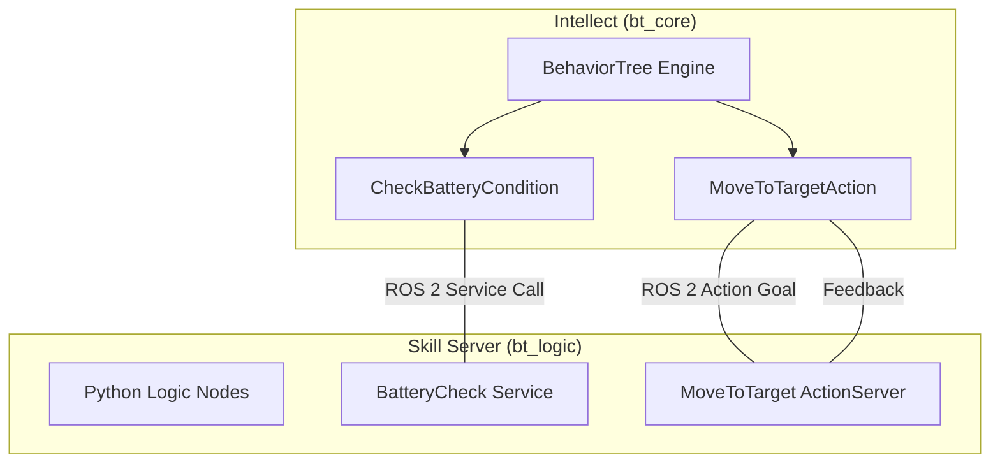

# アーキテクチャ詳細

本プロジェクトは、BehaviorTree.CPP v4 を核とした、プロセス分離型の制御アーキテクチャを採用しています。

## 構成図

## なぜプロセスを分けるのか？ (C++ vs Python)

1.  **リアルタイム性と柔軟性**: 
    高速な判断が必要なツリー実行部は C++ (`bt_core`) で、複雑なライブラリ（AI, 数学計算）を使いたい各スキルロジックは Python (`bt_logic`) で記述できます。
2.  **耐障害性**: 
    あるアクションノードがクラッシュしても、知能である BT エンジンや他のアクションノードは生き残り、リカバリー（別の行動への切り替え）が可能です。
3.  **開発速度**: 
    新しいスキルを追加する際、BT エンジン全体を再コンパイルする必要はありません。新しい Python ノードを起動するだけで、知能は自動的にそれを見つけて連携します。

## 通信の仕組み

- **Action (動作)**: `BT::RosActionNode` を継承。非同期で進捗（Feedback）を受け取りながら実行。
- **Condition (判定)**: カスタムの `RosServiceNode` を継承。同期的に即座に True/False を受け取る。
